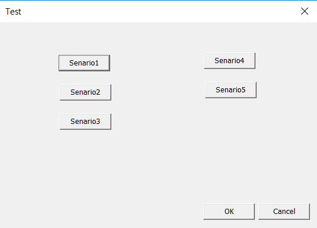
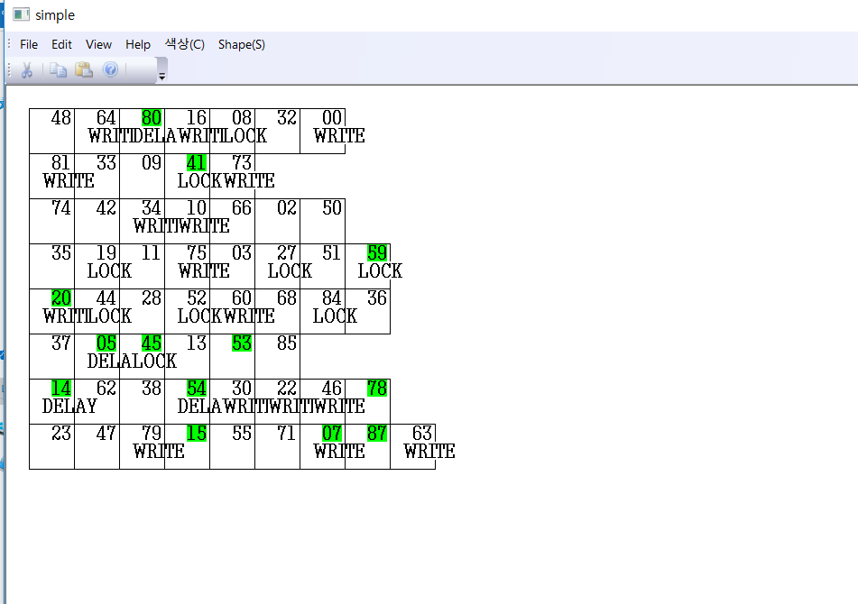

# BufferCash v1.0
Implemented in C++ in order to understand how buffer works in terms of OS.

# WHAT IS THIS?
  운영체제의 버퍼캐쉬 알고리즘을 GUI로 구현하였다.
  해쉬 키(modular 연산)에 따라 버퍼 아이템을 각 테이블 별로
  구분하여 저장한다. OS가 버퍼캐시를 통해 파일 블럭 또는 버퍼에
  접근할 때 나올 수 있는 5가지 시나리오를 시각화하여 구현하였다. 

# ON WHAT HARDWARE DOES IT RUN?
  Platform : Windows
  Dev. Language : C++ (MFC)

# HOW TO WORK?
  프로그램이 실행되면 명세서에 적힌 방식대로 테스트 케이스가 생성되고
  시각적으로 나타나게 된다. 초록색 명암 친 버퍼는 FREELIST에 연결된 것을 의미한다.
  Test 다이얼로그에서 각 시나리오를 누르게 되면 테스트가 진행된다.
  각 시나리오가 요구하는 조건을 만족하지 못할 시에 그 해당 시나리오는 진행되지 않는다. 
    (ex) freelist가 비어 있지 않은 경우 시나리오 4를 누르면 아무 일도 일어나지 않는다.

  
  1.  Hash Queue에 있을 때
	- 찾으려고 하는 버퍼가 busy일 때, (시나리오5 알고리즘 구현)
	- busy가 아닌 경우, freelist에 있으면 freelist에서 버퍼를 제거 후 버퍼를 busy로 만듬 ( 시나리오1 알고리즘 구현 )
2. Hash Queue에 없을 때
 - Freelist가 비어 있을 때, (시나리오4 알고리즘 구현)
 - 버퍼가 Delay인 경우, freelist에서 제거하고 상태를 write로 변경 ( 시나리오3 알고리즘 구현)
 - freelist가 비어있지도않고, 버퍼가 Delay도 아닌 경우 -> freelist의 첫 번째 버퍼를 제거 후 hash Queue에서도 제거 후 새로운 버퍼를 hash queue에 할당. (시나리오2 알고리즘 구현)
 

 # Program Screen Shots

Test Case Generater

Buffer Interface 

 # References
 * 버퍼 캐쉬의 정의
버디 메모리 할당(buddy memory allocation) 기술은 가능한 적당하게 메모리 요청을 만족하도록 메모리를 여러 부분으로 나누는 메모리 할당 알고리즘이다. 이 시스템은 메모리의 크기를 절반씩 분할을 하면서 가장 잘 맞는 크기의 메모리를 찾는다. 도널드 크누스(Donald Knuth)에 의하면, 버디 시스템은 1963년에 해리 마코위츠(Harry Markowitz, 1990년 노벨 경제학상 수상)가 고안한 것으로, 켄 놀튼(Kenneth C. Knowlton, 1965년 출판)[1]에서 처음으로 선보였다.

